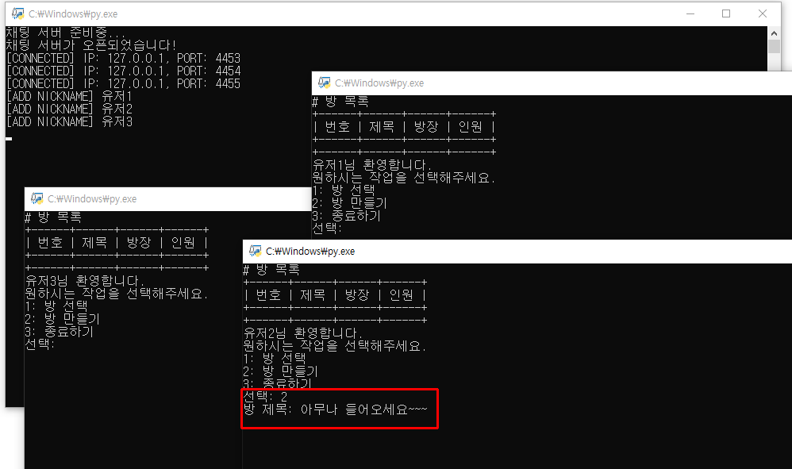
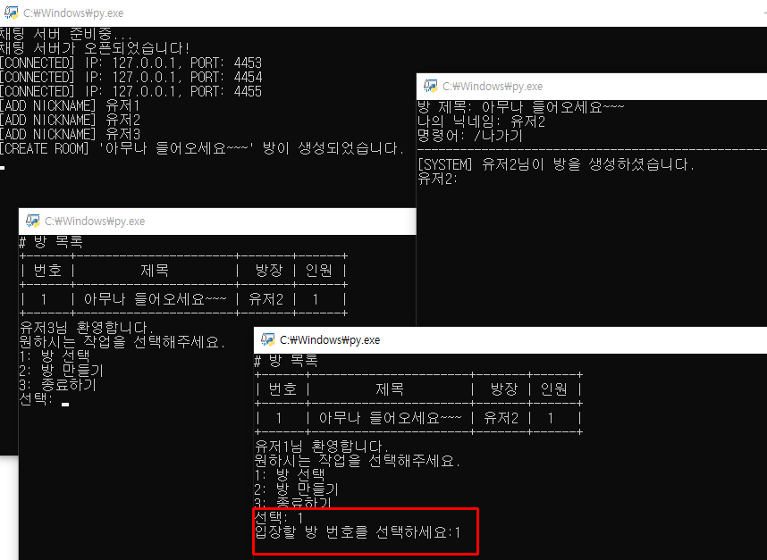
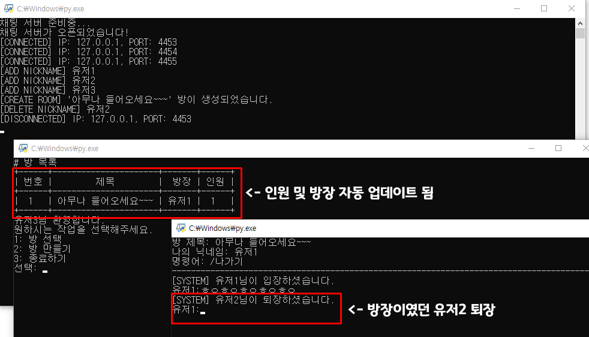
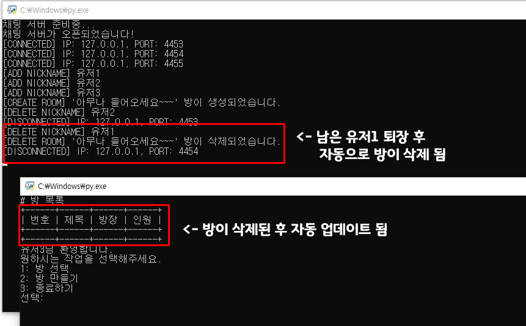

# 3-C 201744079 박재현, TCP/IP 기말 프로젝트
## 프로젝트명: pyMultiChat
### ■ 개요
  - Python으로 멀티 스레드 소켓 통신을 하여 멀티 채팅방이 있는 채팅 프로그램을 제작한다.
### ■ 목적
  - 단순한 채팅 프로그램이 아닌 멀티 룸 구조로 방 생성이 가능하며 
    실시간으로 유저, 방 정보가 업데이트가 되도록 설계된 프로그램을 구현한다. 
### ■ 설계 및 기능
  - 첫 접속 시 닉네임 설정 
    (닉네임은 서버에서 관리 ex. 생성, 중복 검사)
  - 방 만들기 
    (멀티 룸을 구현하기 위해 방을 관리할 딕셔너리 생성하여 관리)
  - 방 정보 업데이트 시 모든 클라이언트에 방송 
    (방 새로고침하여 인원 정보, 방장 정보 등을 업데이트)
  - 유저가 강제종료 혹은 정상 종료 시 속해있는 방이 있으면 내보내도록 설계
  - 방장이 나갈 시 자동으로 다음 유저에게 방장 인계
  - 방에 유저가 없을 시 해당 방을 자동으로 삭제하도록 설계
  - 방 생성, 입장, 삭제 시 대기방(방 선택)에 있는 유저에게 
    방 정보가 자동 새로고침되도록 구현
### ■ 차이점
  - 수업 시간에 학습한 내용은 서버에만 멀티 스레드를 활용하여 
    단일 채팅방에서 채팅을 하는 프로그램을 제작하는 것이였으나, 
    이번에 진행하는 프로젝트는 클라이언트 또한 지속적으로 서버의 메시지를 
    수신할 스레드를 추가하여 진행하였다.
  - 또한 기존에는 단일 채팅방에 유저 구분없이 단순 메시지를 보내는 정도에 그쳤으나, 
    이번 프로젝트에서는 닉네임을 서버에서 검증 및 생성하도록 하였으며, 
    단일 채팅방이 아닌 멀티 채팅방을 구현하였다.
  - 멀티 채팅방은 방 제목을 지정할 수 있고 방 생성, 입장, 삭제 시 모든 유저에게 
    방송하여 방 정보를 '실시간'으로 업데이트하여 확인할 수 있다.
### ■ 라이브러리
  - 방 목록을 이쁘게 출력하기 위해 PrettyTable 사용 
    (설치: pip install PrettyTable)
### ■ 실행 결과 이미지
  - 서버 실행
    
  - 클라이언트 접속(3명)
    
  - 3명의 클라이언트 중 1명의 닉네임 설정(유저1)
    
    
  - 중복 닉네임 가능한지 확인 + 닉네임 설정(유저2)
    
  - 남은 유저 닉네임 설정(유저3)
    
  - 방 만들기(방 제목: 아무나 들어오세요~~~, 방장: 유저2)
    
    
  - 방 입장하기(이전에 생성한 방 입장)
    
    
  - 방장인 유저(유저2) 접속 종료(나가기)
    
  - 남은 유저(유저1) 접속 종료(나가기)
    